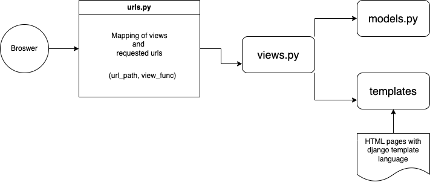
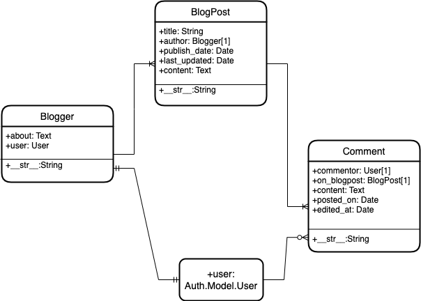

# Mini Blog in Django
I created this github project to learn Django which can be referenced by others who are interested in walking down the same road.
I will be covering below:

- What is Django?
- What basics you need to know to grasp what is happening in Django while doing development?
- Important use cases and scenarios that one comes across during basic Web Development.

My approach will be to help readers learn Django on use case basis rather than forcing one to go through Documentation of Django.

## What is Django?

Django is a MVT framework written in python to come up with fully functional websites in least time and effort possible. How Django accomplishes it?
Well Django comes with batteries included. Basically all the problems that web developers face during development are already taken care of in Django
and Django developers need not reinvent the wheel. Most of the efforts should be put in finding what is already provided by Django and use it judiciously.

### What is MVT Framework?

MVT stands for Model View Template. Now this is a standard design which is used to facilitate easy refactoring and scaling of the application. Lets dive in the terms one by one.
- **Model**: Each website has its data stored in some form of database. The database usually has entity relationships implemented in its schema. In general scheme of things we need to create Database first with all the schema in place containing tables as entities and the constraints applied. Model part of the MVC takes care of the creation of database entities through code rather than manually. Basically what is done under the hood is normally called as ORM (Object Relational Mapping). You can see the ORM as the layer that connects object oriented programming (OOP) to relational databases. So you write a code in Python decalring models and Django will take care of reflecting its appropriate database structure. For more intuitive understanding search about ORM. Spring Boot is another framework that integrates well with ORM framrworks such as Hibernate. Remember ORM is a Design Pattern not a framework. Similarly MVC is also a design pattern. These design patterns when implemented in any particular langauge are handed over to Devs for development are called frameworks. Django is a Python MVT framework.
    - Model defines the data of the web application which would be persisted in some database technology such as sqlite, mysql or postgresql etc.
- **View**: Now Model takes care of the data persistence part of the website. But a website is all about being viewed by a user and a website is being viewed in some browser in form of HTML pages (called as templates). What happens is we have HTML pages in form of templates and these templates would be filled with appropriate content, rendered by a broweser and viewed to the user upon some user's request. It is the task of the server to listen to the client browser, pick appropriate template, fill it with needful model data, construct a final HTML page and show it on the browser.
    - In nutshell View defines the logic of what to display on a particular request
- **Template**: This is the static content of the website i.e HTML pages that could be updated with dynamically generated content by the server and used by View to display to the user.

### What Django offers as MVT?

Now Django is a MVT framework written in python. To develop in Django you must know that Django provides Model, View and Templates as python files namely models.py, views.py, HTML files as templates.

- **models.py** - You write your models here. Django provides an inbuilt class that one needs to extend. The class is `django.db.models.Model`
- **views.py** - this python file defines the Views (functions or class based) that would be called upon a particular request. View functions can either use default templates or can be configured to call a particular template along with the data stored in model.
- **urls.py** - this file provides the mapping between URL request hit and corresponding view function.
- **templates** - these are HTML files which are saved with Django template language to support dynamic content generation. Basically a view function takes care of passing the appropriate context to the template and using the context we can display the information in HTML using Django template syntax.

See the diagram below.



To know more about Django read here on [MDN Web Docs](https://developer.mozilla.org/en-US/docs/Learn/Server-side/Django/Introduction).


## Solving the Django Mini Blog Assignment 

We will solve the [Django Mini blog Assignment](https://developer.mozilla.org/en-US/docs/Learn/Server-side/Django/django_assessment_blog) mentioned on MDN Web Docs. It is required that you must have gone through the [tutorial](https://developer.mozilla.org/en-US/docs/Learn/Server-side/Django/Tutorial_local_library_website) first and should have learned how to set up the Django with python virtual environments. It is assumed that you already know python. The aim of this project and illustrative readme file is to directly present you the solutions of the common problems that one would come across with development in django.

1. **Figuring out the schema and entity relationship diagram** - The first step is to design the database schema. In django you would use the models.py that would create the required schema. There is no need to decide on the database software to be used first. Django would take care of reflecting the ERD(Entity Relationship Diagram) described through models in models.py in whatever database is configured for Django e.g mysql, postgresql etc. Lets go through the entities involved.
    
    - _BlogPost_: Everyblog post should have a title, an author who actually created that blogpost, dates when blogpost was published and last edited, content of the blogpost and comments by the users who are logged in.
        - Every blogpost would have only one author which implies a many-to-one relatioship.

    - _Blogger_: Every blogger who is able to create a blogpost should have a first name and last name and other user details. These details can be stored by mapping a Django inbuilt user as a foreign key.
        - about: text field that contains some biographical information about the blogger.
        - user: django auth.user mapped as foreign key with blogger
    
    - _Comment_: A user can comment on any blogpost and only the commentor can edit the comment. Comment would be posted on a particular date and could be edited anytime:
        - commentor: mapped with django inbuilt user as foreign key
        - on_blogpost: blogpost on which user has commented
        - content: what is commented on?
        - posted_on: Date when comment as posted
        - edited_at: date when comment was edited by its commentor.
    
   
    See Diagram Below:

    

    - A blogger has one-to-many relationship with BlogPost
    - A Comment has many-to-one relationship with user
    - A blogger has one-to-one relatioship with Django inbuilt user

2. **Creating Models in models.py** Django provides `django.contrib.auth.models.Model` class which can be extended to create Models.
    Blogger model. 
    - We import the model as `from django.db import models` and use `models.Model` class as shown below.
    - Now to implement users in Django we can either either extend the AbstratUser and create our custom user or we can use the existing User model as one-to-one key. We have used the later approach. For further reading go through [extending-the-existing-user-model](https://docs.djangoproject.com/en/4.1/topics/auth/customizing/#extending-the-existing-user-model)
    - Model class provides few functions that one can override to achieve desired functionality.
        - first function is `__str__` that is overridern to return the desired name for the object which could be displayed in admin site. (Note: Here we assume you have gone through the [tutorial](https://developer.mozilla.org/en-US/docs/Learn/Server-side/Django/Tutorial_local_library_website) )
        - second function is `get_absolute_url` which is useful when we will dive into views (CreateView, ListView etc). After creating a blogger instance we can use the default redirect to the url provided by this function. In the code below the function returns the path to blogger-detail page. We will further dive into it.

```
from django.db import models
from django.contrib.auth.models import User
from django.urls import reverse_lazy


class Blogger(models.Model):
    user = models.OneToOneField(User, null=True, on_delete=models.SET_NULL)
    about = models.TextField(max_length=2000, null=True)
    slug = models.SlugField(max_length=50)

    def __str__(self) -> str:
        return f'{self.user.first_name} {self.user.last_name}'
    
    def get_absolute_url(self) -> str:
        return reverse_lazy('blogger-detail', kwargs={'slug': self.slug})
```

3. **Running Django Migrations**

    - Once the models are defined in `models.py` we need to run the migrations. Running migrations in this context essentially means we are sort of running database migration changes. After migrations are completed, Django would reflect the expected changes in database schema. We esentailly run two commands `python3 manage.py makemigrations` and `python3 manage.py migrate`
    - On running `makemigrations` command python files are created in migrations folder that describe the changes to be made to schema. Then `migrate` command would commit those changes to database (pre-configured in `settings.py` default is sqlite)

4. **Creating a view function and mapping a template**

    - In `views.py` we write functions or class-based views that would render and return a certain template. We map the view written in `views.py` to a specific url pattern that a browser could request. When the specific request is made Django knows what to show to the user based upon view-to-url mapping.
    - As a simple example lets consider a home page that would be shown once a user hits the domain name only.
        ```
        urlpatterns = [
        path('', views.home, name='home'),
        ]
        ```
    - Now `views.home` is a function defined in `views.py`. Check below code snippet. It takes request as an argument.
        ```
        from django.shortcuts import get_object_or_404, render
        
        def home(request):
            return render(request, 'home.html')
        ```
    - Now anytime the url `http://127.0.0.1:8000/` would be hit it would load the HTML page `home.html`

5. **Understaing urls.py both at django level and app level**

    - When we create a django project using `django-admin startproject miniblog .` then a file named `urls.py` is created at the project level. 
    - When we create a django app using `django-admin startapp blog` then another file with same name `urls.py` is added to the app level structure.
    - Hence we have two `urls.py` files. We use the one at app level to add urls specific to `blog\` and updated the project level `urls.py` to include `blog.urls` 
        ```
        # miniblog.urls.py - file at project level includes the urls from app level i.e blog.url.py
        from django.urls import path, include

        urlpatterns = [
            path('admin/', admin.site.urls),
            path('', include('blog.urls')),
            path('blog/', include('blog.urls')), # this line help includes the all the urls from blog.urls.py
            path('accounts/', include('django.contrib.auth.urls')),
        ]
        ```

        As an example `blog/blogposts` would load all the blogposts. Check the github code of this project to understand.
    
6. **Next we will use the admin site to populate data**

    - In `urls.py` at project level, we add below code `path('admin/', admin.site.urls),` so that we can access the admin section provided by Django. Now to login to admin one must have created a superuser using `python3 manage.py createsuperuser` (manage.py file is created when you create a django project as stated earlier)
    - Now using the superuser credentials login to admin site at `http://127.0.0.1:8000/admin` and using admin portal populate some data so that we can later on exploit the generic Views provided by Django to show the data.
    - Make sure `DEBUG = True`

7. **Usecase 1: Showing the list of data**

    - More often we want to show a list of data available for e.g in our case we would like to show the list of bloggers on a particular page.
    - Django provides an inbuilt-view for this `django.views.generic.ListView`
    - We can write a class based view extending the ListView class. We need to tell the new class which model to use.
        ```
        from django.views import generic


        class BloggerList(generic.ListView):
            model = models.Blogger
        ```
    - In `urls.py` view should be mapped to a particular url pattern. Append this `path('bloggers/', views.BloggerList.as_view(), name='bloggers'),` to `urlpatterns` list. Notice we map the view function in url pattern and to do that with a class based view we use `as_view()` function.
    - By default template page this list view picks from is `blog\templates\blog\blogger_list.html`. Format of the name is `model_list.html`. Therefore we need to create the template `blogger_list.html`.

8. **Usecase 2: Dealing with the templates and reusing them**

    - In Django we can create a base template that can be extended with other templates. Usually sections that would remain unchanged are put in the base template and the content block that is likey to change with childern template is programmed with the help of Django template language. Refer [link1](https://docs.djangoproject.com/en/4.2/ref/templates/language/) and [link2](https://www.w3schools.com/django/django_template_variables.php)

    - Base template for this project can be checked [here](blog/templates/base_generic.html)

    - Extending base template to create `blogger_list.html`. Use syntax at the top `` to extend. In base template you can define blocks as ` ` and you can override the block in child template using name of the block.  Below is how the blogger_list template looks.

        ```
        
        
        <div>
            <h1>Meet our bloggers!</h1>
            <ul>
                 
                <li><a href="">{{blogger.user.first_name}} {{blogger.user.last_name}}</a> </li>
                
            </ul>
        </div>
        
        ```
    - Note: We have used slugs in place of primary keys. The reason is it is not secure to expose the primary keys to the end user as they are auto-incremented and can easily be guessed.

9. **Usecase 3: Showing details of a particular record**

    - Clickable links in the list of data from listview which opens the detail of the instance.

    - To have the detail of a particular model entry Django provides `django.views.generic.DetailView`

    - Similarily to ListView we need to create an HTML page `<model>_detail.html`. In our case we will create `blogger_detail.html` by extending the base template.

    - The template would be mapped to detail view by default similarily to what we did in the case of list view.

    - Check the detail page [blogger_detail.html](blog/templates/blog/blogger_detail.html), detail view [BloggerDetail](blog/views.py) and mapping with [urls.py](blog/urls.py)

10. **Usecase 4: Mapping detail view templates as hyperlinks in ListView**
    - To create hyperlink in HTML we use anchor tag. In HTML with the help of django template syntax we populate the value of `href` attribute using the `url` keyword.

    - Here is what we use `<a href="">{{blogger.user.first_name}} {{blogger.user.last_name}}</a>`. The `url` keyword accepts the `name` of the `urlpattern` mentioned in the `urls.py` as `path('blogger/<slug:slug>', views.BloggerDetail.as_view(), name='blogger-detail'),`. In template we use the `name` value to tell `url` keyword which path we are interested in creating. Then another argument passed to `url` is `blogger.slug` to identify which object's detail we want to refer to.

    - Remember we have used slugs but as a beginner you can start with ids.

    - Also notice in `blogger_list.html` Django by default sets a variable in the template context with format `model_list` which translates to `blogger_list` in our case.

    - Then using the Django For-Loop we iterate through the blogger list, access the blogger iterable and show an anchor based hyperlink using iterable. Check code below:
        ```
         
        <li><a href="">{{blogger.user.first_name}} {{blogger.user.last_name}}</a> </li>
        
        ```

10. **Usecase 5: Taking care of DateFields which provide valuable information about the resource**
    - Many a times we require resource to have the information when it was first created and when it was last updated. Not only this information is required to debug using the data in production when a production incident happens but also it provides the important historical information to the data analysts these days using which they can comment on the user behaviour.
    - Generally table have one column `created_at` which tells the date time when the resource was created for the first time. At this time create_at and updated_at have the same value.
    - Then we have another column `updated_at` which gets updated with date time everytime a resource is updated.
    - In Django we can achieve the desired functionality by passing certain arguments to DateFied while defining fields at model level.
    - `auto_now_add=True` will set the DateField column value to `timezone.now()` only when the instance is created. We would not like the value for the column to change so we can set `editable=False`. `auto_now_add` value is set only when a resource is added then afterwards it is no longer affected.
        ```
        publish_date = models.DateTimeField(editable=False, auto_now_add=True)
        ```
    - `auto_now=True` will set the DateField column value to be updated with timezone.now() everytime the instance is saved i.e when the save method is called. Likewise we would not like this filed to be edited by the user but only be affected by the system and we should set `editable=False`
        ```
        last_updated = models.DateTimeField(editable=False, auto_now=True)
        ```

11. **Usecase 6: Supporting CRUD operations in Django - Create**
    - When it comes to list of possible operations while interacting with a website a user mostly perform 4 basic operations. Create a resource such as publishing a blogpost. Update a resource such as editing profile or updating an already existing blogpost. Read operations such as check other blogposts. Delete operations in form of deleting commments etc. CRUD stands for Create, Read, Update, Delete.

    - Now Read operation can already be taken care by ListView and DetailView. We need to think of the create, update and delete. Let's take `create` operation first.

    - Django provides `django.views.generic.edit.CreateView` which can be inherited to define a custom View class. 

    - In custom class-based view we can override the value of inherited class members to achieve desired functionality. One member is `model` which is assgined your model class that you want to create e.g `model = models.BlogPost`.

    - Another field is `fields` which accept a list of fields to be shown on the form rendered by Django create view. `CreateView` will offer a form created using the fields available by the model mapped using `model = models.BlogPost`. If all fields are to be included then we can use `fields='__all__'`

    - `CreateView` extends few classes and mixins so that it provides you the attributes from a `form` class as it is supposed to be. To create a resource CreateView should be able to offer a form which a user can fill in and submit from the browser and a resource can be created using the details submitted. Another function that can be overriden from `CreateView` is `form_valid` which is called after valid details are submitted via a form and before `save` method is called. Overriding this method provides you a space where you can do the essential mapping and tweaks with the model object you intend to save.

    - Let us understand the above point with an example. While creating a blogpost it is essential to map the blogger of the blogpost with the logged in user. First we need to fetch the blogger with the logged in user. That we can get through `self.request.user` where `self` is available within the overriden function. `request` is the ongoing request and `user` gives you the logged in django `auth.user`. 

    - We fetch the `blogger` using the `user` available and assign it to the `blogpost.blogger`
        ```
        blogpost.author = models.Blogger.objects.get(user=self.request.user)
        ```

    - To fetch the instance on the left side above we can either use `blogpost = form.save(commit=False)` or `blogpost = form.instance`.

    - Then after doing the essential modifications/mappings with the object itself we need to save and redirect. It is obvious that when a resource is created after successful save we need to redirect user to some proper page usually the detail page of that resource. This can be taken care by overriding another function `get_success_url`.

    - We can create a redirect url using `reverse_lazy` or `reverse`. `reverse_lazy` is preferred because it would not break if `name` of the urlpattern does not exist yet. It is same as using `pass` keyword in python when we do not want to provide any definition yet to function or a class. The `reverse_lazy` takes argument first `name` of the url pattern defined in `urls.py`, then a list of `kwargs`. This could be returned by the function `get_success_url`. 

    - Check class `BlogPostCreate` in [views.py](blog/views.py)

12. **Usecase 7: Supporting CRUD operations in Django - Update**
    
    - When a resource is created then a user would like to update that resource in the future. Djagno provides `django.views.generic.edit.UpdateView`.

    - Similar to other edit views it provides two fields - `model` and `fields`. Both are mandatory fields. Their usage is similar to the one described in `CreateView`.

    - We can also override `form_valid` function if required. In most cases no further mapping is required during update at the resource besides the content update therefore usage of `form_valid` function does not arise.

    - By default the template name is supposed to use the suffix `_form` which is same as that used for `CreateView`. Usually one does not have to create a separate update form. But if a need arises we can override the suffix value and create an HTML page accordignly: `template_name_suffix = "_update_form"` and page name would be `blopost_update_form.html`

    - Either we can define success url by overriding `get_success_url`  or we can do it in less code by defining the absoulute url at model level. Go to the model class and override function `get_absolute_url` returning the detail page url for the instance.
        ```
        def get_absolute_url(self) -> str:
            return reverse_lazy('blogpost-detail', kwargs={'slug': self.slug})
        ```

    - Like every other view it has to be mapped to a particular url pattern. Since we are updating a particular resource url patter would need some identifier to identify the resource under action. We prefer `slug` for this case.

13. **Usecase 8: Supporting CRUD operations in Django - Delete**

    - Needs to be defined like other edit views. `model` is a mandatory assignment. `fields` is not required because you do not need to show a form for accepting the values of model-fields. Infact you need a form that would only ask the user for confirmation to delete.

    - Therefore the suffix for the template is `_confirm_delete`. Example - `blogpost_confirm_delete.html`.

    - Like `update` we need something to identify the resource we want to delete. Hence we need to construct the url pattern accordingly and map with the delete view. 
        ```
        path('blogpost/<slug:slug>/delete', views.BlogPostDelete.as_view(), name='blogpost-delete'),
        ```

    - After delete we would want the user to redirect to list of existing resources. For this we either use static `success_url` or override function `get_success_url`.

14. **Usecase 9: Adding support for User Registration**

    - When builiding a website we want visitors to register themsleves so that they can later login to the website and are allowed to do certain operations. This requires a user registration system in place. We can use the inbuilt django forms.

    - We have not mentioned about Django forms till yet. Like `views` Django offers `django.forms` as well. We create a file `forms.py` in which we can define class based forms by extending `forms.ModelForm`

    - For Registration form we can extend `django.contrib.auth.forms.UserCreationForm` to create `RegisterForm`. Check [forms.py](blog/forms.py)

    - In `views.py` we can create a `RegisterFormView` class extending `CreateView`. In the class definition we can tell which form to use by assigning value to `form_class` member : `form_class = forms.RegisterForm` 

    - Since this is not any inbuilt Djagno view we need to tell the view which tempalte to use using `template_name = 'register.html'`

    - Template would be kept at folder called templates under blog e.g `blog/templates/register.html`

    - Notice the difference between the location of `model_detail/list` pages and `register.html` pages. Pages for default generic views are expected under a separate folder with name same as that of the djagno app inside `templates` directory i.e `blog\templates\blog...`. Where as `register.html` is kept directly under `templates`.

    - Like always a view needs to be mapped with a url pattern. Check out the url pattern with name `register` in [urls.py](blog/urls.py)

15. **Usecase 10: Using inbuilt Authentication to support login, logout, password change etc**

    - We can use the inbuilt set of urls and pages available `django.contrib.auth.urls`. 
        ```
        path('accounts/', include('django.contrib.auth.urls')),
        ```
    - This provides the below urlpatterns. Django provides these as admin pages.          
        1. accounts/login/ [name='login']
        2. accounts/logout/ [name='logout']
        3. accounts/password_change/ [name='password_change']
        4. accounts/password_change/done/ [name='password_change_done']
        5. accounts/password_reset/ [name='password_reset']
        6. accounts/password_reset/done/ [name='password_reset_done']
        7. accounts/reset/<uidb64>/<token>/ [name='password_reset_confirm']
        8. accounts/reset/done/ [name='password_reset_complete']
    
    - We can include the above urls using `path('accounts/', include('django.contrib.auth.urls')),` in `<project>.urls.py`.

    - Then in template we can provide anchor links to redirect the user to login.logout pages.

    - If user is logged in then we need to show the logout link else we should show login link. We can check this condition using `` in template itself. Check [base_generic.html](blog/templates/base_generic.html)

    - After login through inbuilt django feature it redirects to the profile page. Either we can fulfill this need by creating profile section or we can chose to redirect to another page. This can be achieved by overriding `LOGIN_REDIRECT_URL`. Check in [settings.py](miniblog/settings.py)
        ```
        # Redirect url after successful login
        # default = /accounts/profile
        LOGIN_REDIRECT_URL = 'home'
        ```
    
    - To use above url patterns successully we need to ensure that `login.html` and `logged_out.html` pages are available in the `templates\registration` folder. The folder `regsitration` need to be created first.

16. **Usecase 11: Using an existing ListView to show a list of all entries and filtered entries**
    
    - In our Django Blog assignment we need to show list of blogposts in 2 ways. First is the list of all blogposts available that a vistor can browse through. Second is the list of the blogposts created by the logged in blogger itself.

    - To show the list of all blogposts we can use the simple listview mechanism. But to show the list of blogposts created by the logged in blogger we need to have a fitlering mechanism.

    - Showing the list of all blogposts would need url pattern `path('blogposts/', views.BlogPostList.as_view(), name='blogs'),`. 
    
    - To show the list of selected blogposts we need to provide another link to user which should pass on the `username` information based on which the listview can provide the filtered result. 

    - We will use the url pattern for desired link as `path('blogposts/<str:username>', views.BlogPostList.as_view(), name='user-blogs'),`.

    - Now when `user-blogs` is used in the template we ensure that we pass the username as the kwarg to it. 
        ```
        <li><a href="">See your blogposts!</a> </li>
        ```
    
    - Next we need to override the function `get_queryset` in our class that extended ListView. Check `BlogPostList` in [views.py](blog/views.py)
        ```
        def get_queryset(self):
            queryset = super().get_queryset()
            if 'username' in self.kwargs:
                blogger_name = self.kwargs['username']
                if blogger_name:
                    found_user = models.User.objects.get(username=blogger_name)
                    found_blogger = models.Blogger.objects.get(user=found_user)
                    queryset =  models.BlogPost.objects.filter(author=found_blogger).order_by('-publish_date')
            return queryset
        ```

    - In the function first we get the queryset from super function. Then we check if `username` was passed in the `self.kwargs`. If passed we fetch that value and use that value to find the mapped user. Once the mapped user is found we use that user to find the linked blogger. Then using the `found_blogger` we get a queryset that returns the blogposts whose author is the `found_blogger`. We use Djagno Query Language to query model data. Refer these two links [link1](https://www.w3schools.com/django/django_queryset.php) and [link2](https://www.javatpoint.com/django-orm-queries)

17. **Usecase 12: Restricting operations only for logged in users**
    
    - More often we want users to be able to access certain web pages only when they are logged in. Django python offers a useful mixin called `LoginRequiredMixin`. Mixins are special python classes that can be extended to involve special behaviours. Django package `django.contrib.auth.mixins` provides a whole lot of mixins such as `PermissionRequiredMixin` or `UserPassesTestMixin`. 

    - Knowing how to use these mixins can pretty much help solve all the possible usecases of restricting authorization to a user based on certain criteria.

    - `LoginRequiredMixin` when extended by a view ensure that a user must be logged in for that view to function. If not used would be redirected to perform login first.

    - As an example we want user to be able to see blogposts without login but same user should be restricted to view list of bloggers if not logged in.
    Hence we extend bloggerlist view with LoginRequiredMixin. We need to take care of the order in which Mixin is imported. `LoginRequiredMixin` should be the first class imported before the `generic.listview`. Check in `views.py`

18. **Usecase 13: Allowing certain views only when a user passes a certain condition**

    - In many cases we want a view to function when the user accessing that view passes a certain test criteria. Example - A blogger should only be able to update his own created blogposts and not others, a user should be edit/delete only his or her comments and not others'.

    - For such use cases we can use `UserPassesTestMixin`. Extending this mixin would let us override a function called `test_func` where we can return True/False depending on a certain conditional test. This means if condition passes the test function passes returning True allowing the view to operate successfully.

    - Check update and delete views of Blogpost, Blogger, Comment in `views.py` to understand the usage with help of an example.

19. **Usecase 14: Implementing pagination for listviews**

20. **Usecase 15: Sorting the data at template level**

21. **Usecase 16: Sorting the data at view level**

22. **Usecase 17: Sharing context through context processors**

23. **Usecase 18: Using slugs to avoid usage of primary keys and improved searchability**

24. **Usecase 19: Customising 403 and 404 templates**

